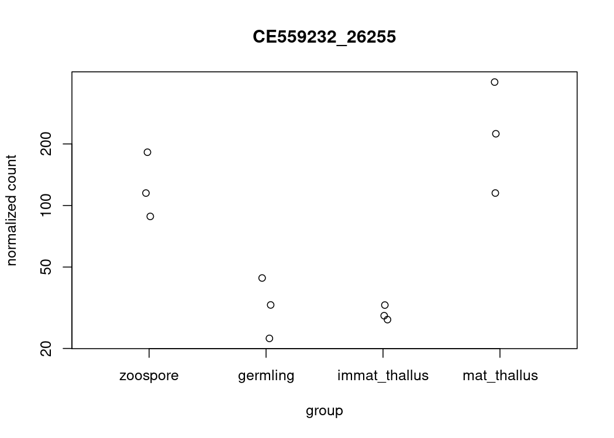
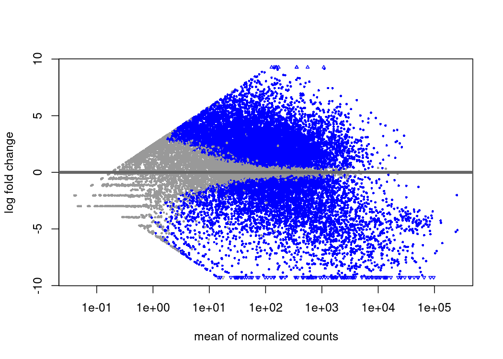
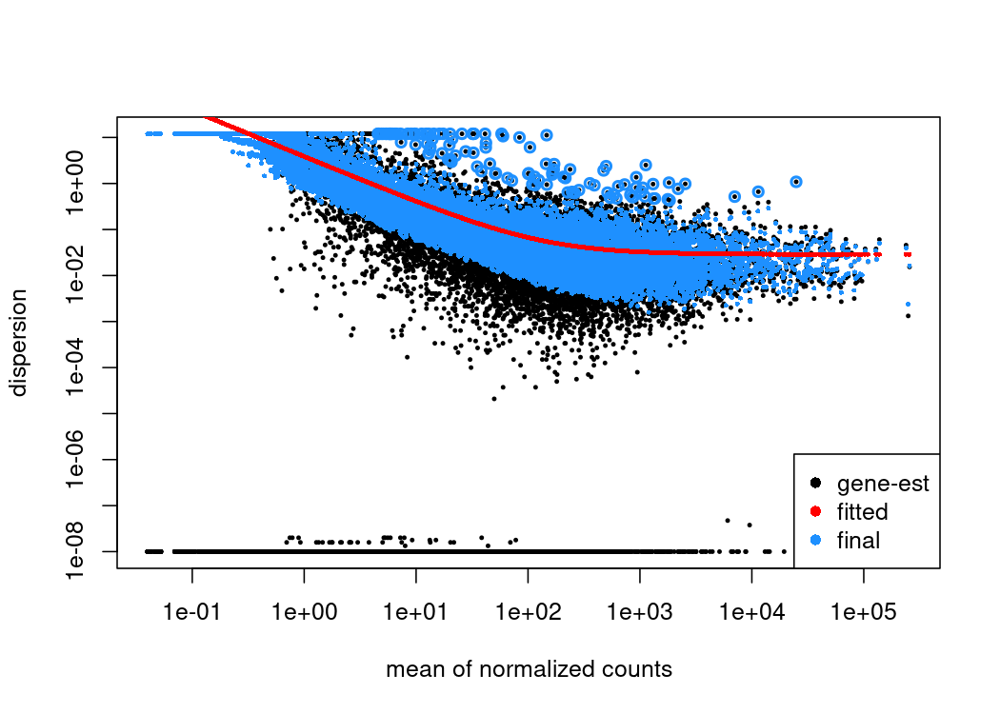
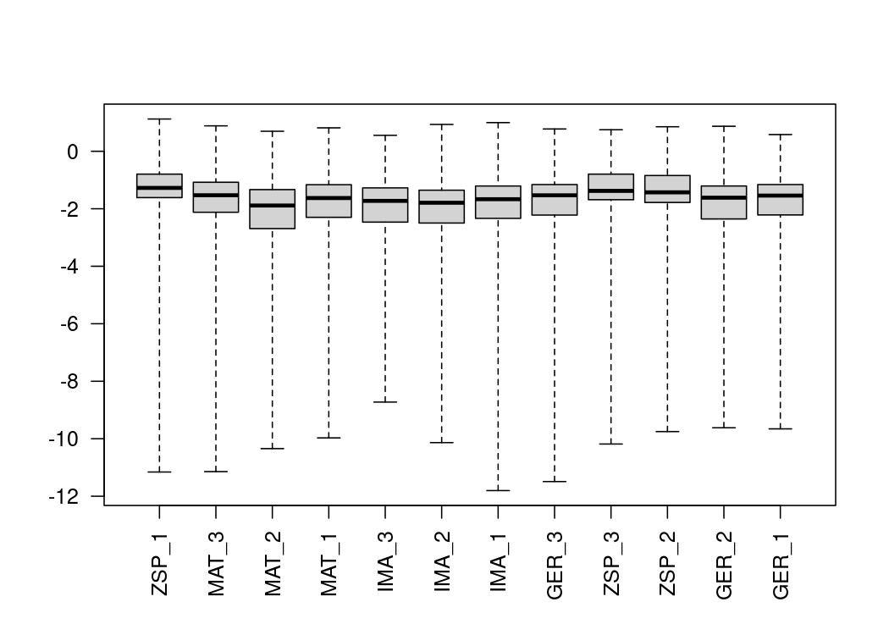
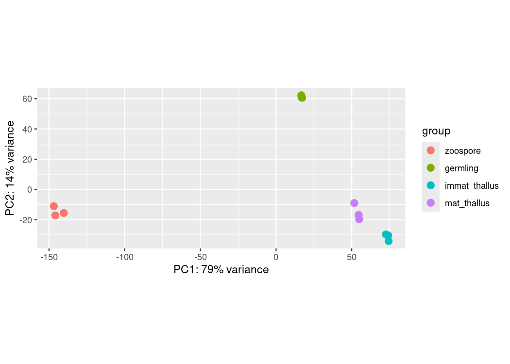

RNAseq of SRP350860 (Rhizoclosmatium globosum JEL800)
================
Kelterborn
2024-06-24

- [0) Preparation](#0-preparation)
  - [-R_libraries](#-r_libraries)
  - [-R_folders](#-r_folders)
  - [-R functions](#-r-functions)
  - [-Unix packages](#-unix-packages)
  - [-Unix folders](#-unix-folders)
  - [-Download data](#-download-data)
- [1) Mapping](#1-mapping)
  - [-Make index](#-make-index)
  - [-Quantification](#-quantification)
- [2) Differential gene expression
  analysis](#2-differential-gene-expression-analysis)
  - [-Sample table](#-sample-table)
  - [-Tximeta](#-tximeta)
  - [-DESeq2](#-deseq2)
- [Export data](#export-data)

RNA-Seq of Rhizoclosmatium globosum JEL800

Raw files <https://trace.ncbi.nlm.nih.gov/Traces/study/?acc=SRP350860>

# 0) Preparation

## -R_libraries

## -R_folders

## -R functions

## -Unix packages

``` bash

mamba create -n salmon salmon fastqc multiqc sra-tools
mamba activate salmon
```

## -Unix folders

``` bash
dir="/mnt/s/AG/AG-Scholz-NGS/Daten/Simon/Rhihy1"
fastq=$(echo $dir/fastq)
index=$(echo $dir/index/rhihy1_v1_index)
genomic=$(echo $dir/genomic)
```

## -Download data

### -FASTQ files

<https://trace.ncbi.nlm.nih.gov/Traces/study/?acc=SRP350860>

Download “Accession List” as text file. Download via NCBI SRA tools
(unix) Note: alternative to fast-dump: faster-dump or
parallel-fastq-dump
<https://github.com/ncbi/sra-tools/wiki/HowTo:-fasterq-dump>

``` bash
cd $fastq
srr=$(cat SRR_Acc_List.txt)
prefetch -v $srr
for fn in $srr; do fastq-dump --gzip --outdir . --split-files $fn; done
```

### -Rhihy1 genomic data

Download genomic datra from:
<https://mycocosm.jgi.doe.gov/Rhihy1/Rhihy1.home.html> -\>
<https://genome.jgi.doe.gov/portal/pages/dynamicOrganismDownload.jsf?organism=Rhihy1>

Reference: Nat Genet. 2017 Jun;49(6):964-968. doi: 10.1038/ng.3859

Rhihy1_AssemblyScaffolds_Repeatmasked.fasta.gz
Rhihy1_EST_20151219_cluster_consensi.fasta.gz
Rhihy1_FilteredModels1_deflines.gff3.gz

#### -fix transcriptome file

Adapt Transcriptome names to GFF file

``` r
# Gene catalogue
gtfdata <- readLines(file.path(paste(dir,"genomic/Rhihy1_GeneCatalog_genes_20151219.gff.gz",sep="/")))
head(gtfdata, n=10)

# Transcriptome
transcripts_path <- file.path(paste(dir,"genomic/Rhihy1_GeneCatalog_transcripts_20151219.nt.fasta.gz",sep="/"))
transcripts <- readLines(transcripts_path)
head(transcripts, n=10)[2] %>% str_length()

# extract seq names
old_name <- get.fasta.name(transcripts_path)
length(old_name)

transcriptId <- str_split(old_name,pattern = "\\|", simplify = T)[,3]
length(transcriptId)

transcript_name <- str_split(old_name,pattern = "\\|", simplify = T)[,4]
length(transcript_name)

# generate new name
new_name <- paste(transcript_name, " transcriptId:",transcriptId,sep="")

# replace old names
transcripts_path_new <- "/mnt/s/AG/AG-Scholz-NGS/Daten/Simon/Rhihy1/genomic/Rhihy1_GeneCatalog_transcripts_20151219.nt.fixed.fasta"
ref2 <- data.frame(old_name, new_name)
rename.fasta(infile = transcripts_path, ref_table = ref2, outfile = transcripts_path_new)
unlink("transcripts_path")
unlink("transcripts_path_new")

transcripts <- readLines(transcripts_path_new)
head(transcripts, n=10)

# -> wrong line breaks!
```

#### -add line breaks

install fastx-toolkit

``` bash
# fasta_formatter -h
#   usage: fasta_formatter [-h] [-i INFILE] [-o OUTFILE] [-w N] [-t] [-e]


fasta_formatter -i Rhihy1_GeneCatalog_transcripts_20151219.nt.fixed.fasta -o Rhihy1_GeneCatalog_transcripts_20151219.nt.fixed.lines.fasta -w 70

gzip -k Rhihy1_GeneCatalog_transcripts_20151219.nt.fixed.lines.fasta
```

``` r
readLines(paste(dir,"/genomic/Rhihy1_GeneCatalog_transcripts_20151219.nt.fixed.lines.fasta.gz",sep="")) %>% head(n=10)
```

    ##  [1] ">CE99369_221 transcriptId:100092"                                      
    ##  [2] "GACAAAGCAGAGCTGGCGGGACTTCCTACGGGAGACATTGAACTCAATAACGATATAGAATTACAATCCC"
    ##  [3] "ATCACAAGGAAATCAATCCACAAATCACTCCAAAAACCACTATGCAAATCGATATCTTCAATCTTTTCGC"
    ##  [4] "TGTGTTCTCGATCGCCGTCTCTGCGGCAAATATAGTTCCAGTTGCTGTGGGCGGTGCTTGTGGGGGCTCC"
    ##  [5] "ATCCAAAATGCCCCCATTTGCGACACAAACTTGGACTGTGTTTCTACGTCAGGTGCACCAGGATCAGCTG"
    ##  [6] "GAATCTGTACACTTAAAGTAAGCGACGTCGGAGGACCGTGTCAACAGCCACTTCAATATTCTGCCGTGTG"
    ##  [7] "TAAAGCGGGACTCGTTTGTGTGCTGCCACCCTATCCGATTATGCCTGGCGCTTCAGGGACTTGTCAGATC"
    ##  [8] "GAGATTTGTAGCTCCAGGACAAGTACGATGACAGCTGTTGCTTCAACGGGTGGTTATCCAGCTCCGATTA"
    ##  [9] "CGAAACCGGCCACATCGACAACGACTTGGAAGCAAAGCGCTTCTCTCGCAGGAATTGTTGTGTCGTTTGG"
    ## [10] "GATTCTTGCTTTACCCACTCTTTTATTGTGAAAAACAGATTAATAAAAATGTCCGAAAAGTATCCAGTCA"

# 1) Mapping

## -Make index

``` bash

cd $genomic

# create list of chromosomes -->
grep "^>" <(gunzip -c Rhihy1_AssemblyScaffolds_Repeatmasked.fasta.gz) | cut -d " " -f 1 > decoys_rhihy1_v1.txt

# the created .txt contains ">" in front of all chromosomes, use to remove:
sed -i.bak -e 's/>//g' decoys_rhihy1_v1.txt

# check that ">" is removed
nano decoys_rhihy1_v1.txt
# to exit vim: press Esc -> :q -> Enter

# Combine the different files
cat Rhihy1_GeneCatalog_transcripts_20151219.nt.fixed.lines.fasta.gz Rhihy1_AssemblyScaffolds_Repeatmasked.fasta.gz  > gentrome_rhihy1_v1.fa.gz

# make index with salmon
# the number behind -p defines the number of cores used to index. Currently (04/2024) 10 is the maximum... this is weird. If you use more, an index is generated but some data is missing, leading to downstream problems.

mamba activate salmon

cd $genomic
salmon index -t gentrome_rhihy1_v1.fa.gz -d decoys_rhihy1_v1.txt -p 10 -i $index
```

## -Quantification

``` bash

mamba activate salmon

fastqfiles=$(ls $fastq/*_1.fastq.gz)

echo "${fastqfiles:0:200}"

for fn in $fastqfiles;
do
bfn=$(echo "`basename ${fn}`");
samp=${bfn%"_1.fastq.gz"};
R1=$fn;
R2=$(echo "$R1" | sed 's/_1/_2/');
echo "Processing Sample: $samp";
test -f $R1 && echo "--> File: $R1 exists"
test -f $R2 && echo "--> File: $R2 exists"
outquant=${dir}/quants/${samp}_quant
echo $outquant
echo $index

salmon quant -i $index -l A \
 -1 $R1 \
 -2 $R2 \
 -p 25 --validateMappings --gcBias -o $outquant

done
```

# 2) Differential gene expression analysis

## -Sample table

``` r
# generate file list from actual mapping files
files={}
for (i in list.dirs(path = quantfolder, full.names = TRUE, recursive = FALSE)) {
files <- c(files,paste(i,"/quant.sf",sep=""))
# print(head(read.table(files[length(files)], header=T)))
}
readLines(files[length(files)]) %>% head()
```

    ## [1] "Name\tLength\tEffectiveLength\tTPM\tNumReads"   
    ## [2] "CE99369_221\t678\t442.000\t0.000000\t0.000"     
    ## [3] "CE99926_618\t656\t420.000\t0.000000\t0.000"     
    ## [4] "CE284_8013\t531\t277.610\t1.237103\t8.000"      
    ## [5] "CE100105_963\t1661\t1295.898\t2.152941\t64.991" 
    ## [6] "CE100127_1153\t1326\t981.599\t5.022863\t114.851"

``` r
coldata <- data.frame(files=files,
                      run=list.files(quantfolder) %>% str_remove(.,"_quant"))
coldata
```

    ##                                                                           files
    ## 1  /mnt/s/AG/AG-Scholz-NGS/Daten/Simon/Rhihy1/quants/SRR17236519_quant/quant.sf
    ## 2  /mnt/s/AG/AG-Scholz-NGS/Daten/Simon/Rhihy1/quants/SRR17236520_quant/quant.sf
    ## 3  /mnt/s/AG/AG-Scholz-NGS/Daten/Simon/Rhihy1/quants/SRR17236521_quant/quant.sf
    ## 4  /mnt/s/AG/AG-Scholz-NGS/Daten/Simon/Rhihy1/quants/SRR17236522_quant/quant.sf
    ## 5  /mnt/s/AG/AG-Scholz-NGS/Daten/Simon/Rhihy1/quants/SRR17236523_quant/quant.sf
    ## 6  /mnt/s/AG/AG-Scholz-NGS/Daten/Simon/Rhihy1/quants/SRR17236524_quant/quant.sf
    ## 7  /mnt/s/AG/AG-Scholz-NGS/Daten/Simon/Rhihy1/quants/SRR17236525_quant/quant.sf
    ## 8  /mnt/s/AG/AG-Scholz-NGS/Daten/Simon/Rhihy1/quants/SRR17236526_quant/quant.sf
    ## 9  /mnt/s/AG/AG-Scholz-NGS/Daten/Simon/Rhihy1/quants/SRR17236527_quant/quant.sf
    ## 10 /mnt/s/AG/AG-Scholz-NGS/Daten/Simon/Rhihy1/quants/SRR17236528_quant/quant.sf
    ## 11 /mnt/s/AG/AG-Scholz-NGS/Daten/Simon/Rhihy1/quants/SRR17236529_quant/quant.sf
    ## 12 /mnt/s/AG/AG-Scholz-NGS/Daten/Simon/Rhihy1/quants/SRR17236530_quant/quant.sf
    ##            run
    ## 1  SRR17236519
    ## 2  SRR17236520
    ## 3  SRR17236521
    ## 4  SRR17236522
    ## 5  SRR17236523
    ## 6  SRR17236524
    ## 7  SRR17236525
    ## 8  SRR17236526
    ## 9  SRR17236527
    ## 10 SRR17236528
    ## 11 SRR17236529
    ## 12 SRR17236530

``` r
# get sample infos from metadata table
accession_table <- read_csv(file=paste(dir,"/fastq/SraRunTable.txt",sep="")) %>% data.frame()
colnames(accession_table)
```

    ##  [1] "Run"                            "Assay.Type"                    
    ##  [3] "AvgSpotLen"                     "Bases"                         
    ##  [5] "BioProject"                     "BioSample"                     
    ##  [7] "BioSampleModel"                 "Bytes"                         
    ##  [9] "Center.Name"                    "Collection_Date"               
    ## [11] "Consent"                        "DATASTORE.filetype"            
    ## [13] "DATASTORE.provider"             "DATASTORE.region"              
    ## [15] "Experiment"                     "geo_loc_name_country"          
    ## [17] "geo_loc_name_country_continent" "geo_loc_name"                  
    ## [19] "Instrument"                     "isolation_source"              
    ## [21] "Library.Name"                   "LibraryLayout"                 
    ## [23] "LibrarySelection"               "LibrarySource"                 
    ## [25] "life_stage"                     "Organism"                      
    ## [27] "Platform"                       "ReleaseDate"                   
    ## [29] "replicate"                      "create_date"                   
    ## [31] "version"                        "Sample.Name"                   
    ## [33] "sample_type"                    "SRA.Study"                     
    ## [35] "strain"                         "Depth"

``` r
# combine metadata with mapping files
coldata <- cbind(coldata,
                 accession_table[,c("Run","Sample.Name","life_stage","strain","SRA.Study","BioProject","BioSample","Experiment")])

# Define sample names
coldata$names <- coldata$Sample.Name

# Make readable condition and order
coldata$condition <- coldata$life_stage %>%
  str_replace(pattern="mature thallus", replacement = "mat_thallus") %>% factor(levels=c("zoospore","germling","immat_thallus","mat_thallus"))
```

## -Tximeta

Summarize all transcript counts to gene level (no gene infos yet…
transcripts = genes )

``` r
# Make manual linked transcriptome

# set paths
file.exists(indexDir, fastaPath, gtfPath)
```

    ## [1] TRUE TRUE TRUE

``` r
quant <- read.delim(files[1])
gtfdata <- read.gff(gtfPath, na.strings = c(".", "?"), GFF3 = TRUE)

head(quant, n=10)
```

    ##              Name Length EffectiveLength      TPM NumReads
    ## 1     CE99369_221    678         435.000 0.000000    0.000
    ## 2     CE99926_618    656         381.018 1.980287   15.000
    ## 3      CE284_8013    531         288.000 0.000000    0.000
    ## 4    CE100105_963   1661        1297.931 0.116266    3.000
    ## 5   CE100127_1153   1326         996.983 1.368521   27.124
    ## 6     CE9470_3264   1490        1145.125 0.175707    4.000
    ## 7    CE102762_108   1177         934.000 0.000000    0.000
    ## 8   CE102972_1236   1375        1132.000 0.000000    0.000
    ## 9  CE103003_12370   1440        1083.354 0.553223   11.915
    ## 10   CE103191_164   1423        1180.000 0.000000    0.000

``` r
head(gtfdata, n=10)
```

    ##         seqid source        type start  end score strand phase
    ## 1  scaffold_1    JGI        exon    86  490    NA      +  <NA>
    ## 2  scaffold_1    JGI         CDS    86  490    NA      +     0
    ## 3  scaffold_1    JGI  stop_codon   488  490    NA      +     0
    ## 4  scaffold_1    JGI        exon   633  676    NA      +  <NA>
    ## 5  scaffold_1    JGI         CDS   633  676    NA      +     0
    ## 6  scaffold_1    JGI start_codon   633  635    NA      +     0
    ## 7  scaffold_1    JGI        exon   819 1001    NA      +  <NA>
    ## 8  scaffold_1    JGI         CDS   819 1001    NA      +     1
    ## 9  scaffold_1    JGI        exon  1031 1109    NA      +  <NA>
    ## 10 scaffold_1    JGI         CDS  1031 1109    NA      +     1
    ##                                        attributes
    ## 1             name "gm1.1_g"; transcriptId 779539
    ## 2  name "gm1.1_g"; proteinId 778817; exonNumber 1
    ## 3                                  name "gm1.1_g"
    ## 4                            name "fgenesh1_pm.1_
    ## 5                            name "fgenesh1_pm.1_
    ## 6                            name "fgenesh1_pm.1_
    ## 7                            name "fgenesh1_pm.1_
    ## 8                            name "fgenesh1_pm.1_
    ## 9                            name "fgenesh1_pm.1_
    ## 10                           name "fgenesh1_pm.1_

``` r
tx_names <- quant$Name
tx_names %>% length()
```

    ## [1] 21592

``` r
tx_names %>% unique() %>% length()
```

    ## [1] 21592

``` r
str_count(quant,pattern="gm1.1_g") %>% table()
```

    ## .
    ## 0 1 
    ## 4 1

``` r
str_count(gtfdata,pattern="gm1.1_g") %>% table()
```

    ## .
    ## 0 3 
    ## 8 1

``` r
str_count(quant,pattern="CE99926_618") %>% table()
```

    ## .
    ## 0 1 
    ## 4 1

``` r
str_count(gtfdata,pattern="CE99926_618") %>% table()
```

    ## .
    ## 0 6 
    ## 8 1

``` r
# # clear bfc
# bfcloc <- getTximetaBFC()
# bfc <- BiocFileCache(bfcloc)
# bfcquery(bfc, "")
# bfcquery(bfc, "Rhihy1")
# 
# bfcremove(bfc, bfcquery(bfc, "Rhihy1")$rid)
# bfcremove(bfc, bfcquery(bfc, "linkedTxomeTbl")$rid)

makeLinkedTxome(indexDir=indexDir,
                 source="MycoCosm",
                 organism="Rhizoclosmatium globosum",
                 release="v1",
                 genome="Rhihy1",
                 fasta=fastaPath,
                 gtf=gtfPath,
                 write=FALSE)

# use tximeta on coldata and save as summarized experiment se


# Use tx2gene

tx2gene <- data.frame(TXNAME=tx_names,
                      GENEID=tx_names)
files <- coldata[,"files"]
names(files) <- coldata[,"names"]

txi <- tximport(files=files, type = "salmon", tx2gene = tx2gene)
head(txi$counts)
```

    ##                 ZSP_1   MAT_3    MAT_2    MAT_1   IMA_3   IMA_2   IMA_1   GER_3
    ## CE100105_963    3.000 218.465  291.820  234.845  97.232  83.419  81.150  41.997
    ## CE100127_1153  27.124 296.708  273.091  245.786 135.770 101.514 131.526  85.445
    ## CE10075_7055  321.000 883.000 1003.000  949.000 971.000 768.000 847.000 849.000
    ## CE10197_11130   3.000 484.000  722.000 1018.000 546.000 561.000 789.000  14.000
    ## CE10237_1997  327.000  13.000    3.000   21.000  29.000  43.000  13.000   6.000
    ## CE102762_108    0.000  38.000   46.000   36.000   8.000  13.000  11.000   1.000
    ##                 ZSP_3 ZSP_2   GER_2   GER_1
    ## CE100105_963   16.000  14.0  48.366  64.991
    ## CE100127_1153  32.313  21.2 141.160 114.851
    ## CE10075_7055  293.000 290.0 831.000 779.000
    ## CE10197_11130   1.000   2.0  15.000   8.000
    ## CE10237_1997  296.000 327.0   4.000   3.000
    ## CE102762_108    0.000   0.0   1.000   1.000

``` r
sampleTable <- coldata
rownames(sampleTable) <- colnames(txi$counts)
dds <- DESeqDataSetFromTximport(txi, sampleTable, ~condition)
```

### -Check mapping rates

``` r
# Plot data:
# The scale of the y axis can be changed by setting ylim = c(y1,y2) values 

barplot(metadata(se)[["quantInfo"]]$percent_mapped, main="Mapping Rate, all samples", names = colnames(se), las = 2, cex.names = 0.5, ylim = c(0,80))
barplot(metadata(se)[["quantInfo"]]$num_processed/1000000, main="Mio. Reads, all samples", names = colnames(se), las = 2, cex.names = 0.5, ylim = c(0,30))
```

## -DESeq2

``` r
dds <- DESeq(dds) 

# Plot example counts
plotCounts(dds,gene = "CE559232_26255", intgroup = "condition")
```

<!-- -->

``` r
# Make results
resultsNames(dds)
```

    ## [1] "Intercept"                           "condition_germling_vs_zoospore"     
    ## [3] "condition_immat_thallus_vs_zoospore" "condition_mat_thallus_vs_zoospore"

``` r
res_germling_vs_zoospore <- results(dds, contrast = c("condition","germling","zoospore"))
res_immat_thallus_vs_germling <- results(dds, contrast = c("condition","immat_thallus","germling"))
res_mat_thallus_vs_immat_thallus <- results(dds, contrast = c("condition","mat_thallus","immat_thallus"))
res_zoospore_vs_mat_thallus <- results(dds, contrast = c("condition","zoospore","mat_thallus"))
```

### QC

``` r
plotMA(dds)
```

<!-- -->

``` r
plotDispEsts(dds)
```

<!-- -->

``` r
boxplot(log10(assays(dds)[["cooks"]]), range=0, las=2)
```

<!-- -->

``` r
# PCA
vsd <- vst(dds, blind=FALSE)
plotPCA(vsd, intgroup=c("condition"), ntop=2000)
```

<!-- -->

# Export data

``` r
res_exp <- data.frame(
  # general
  "name" = rownames(dds),
 # results res_germling_vs_zoospore
 "L2FC.germling_vs_zoospore" = res_germling_vs_zoospore$log2FoldChange,
 "pvalue.germling_vs_zoospore" = res_germling_vs_zoospore$pvalue,
 "padj.germling_vs_zoospore" = res_germling_vs_zoospore$padj,
  # results res_immat_thallus_vs_germling
 "L2FC.res_immat_thallus_vs_germling" = res_immat_thallus_vs_germling$log2FoldChange,
 "pvalue.res_immat_thallus_vs_germling" = res_immat_thallus_vs_germling$pvalue,
 "padj.res_immat_thallus_vs_germling" = res_immat_thallus_vs_germling$padj,
  # results res_mat_thallus_vs_immat_thallus
 "L2FC.res_mat_thallus_vs_immat_thallus" = res_mat_thallus_vs_immat_thallus$log2FoldChange,
 "pvalue.res_mat_thallus_vs_immat_thallus" = res_mat_thallus_vs_immat_thallus$pvalue,
 "padj.res_mat_thallus_vs_immat_thallus" = res_mat_thallus_vs_immat_thallus$padj,
  # results res_zoospore_vs_mat_thallus
 "L2FC.res_zoospore_vs_mat_thallus" = res_zoospore_vs_mat_thallus$log2FoldChange,
 "pvalue.res_zoospore_vs_mat_thallus" = res_zoospore_vs_mat_thallus$pvalue,
 "padj.res_zoospore_vs_mat_thallus" = res_zoospore_vs_mat_thallus$padj,
  counts(dds, normalized=TRUE)[,c("ZSP_1","ZSP_2","ZSP_3", "GER_1", "GER_2", "GER_3","IMA_1", "IMA_2", "IMA_3","MAT_1", "MAT_2", "MAT_3")]
 )
res_exp

write_xlsx(data.frame(res_exp),
           paste(gitdir,"2024_06 Rhihy1 rna-seq.xlsx",sep="/"))
```

``` r
sessionInfo()
```

    ## R version 4.4.2 (2024-10-31)
    ## Platform: x86_64-pc-linux-gnu
    ## Running under: Ubuntu 22.04.5 LTS
    ## 
    ## Matrix products: default
    ## BLAS/LAPACK: /opt/intel/oneapi/mkl/2024.0/lib/libmkl_rt.so.2;  LAPACK version 3.10.1
    ## 
    ## locale:
    ##  [1] LC_CTYPE=de_DE.UTF-8       LC_NUMERIC=C              
    ##  [3] LC_TIME=de_DE.UTF-8        LC_COLLATE=de_DE.UTF-8    
    ##  [5] LC_MONETARY=de_DE.UTF-8    LC_MESSAGES=de_DE.UTF-8   
    ##  [7] LC_PAPER=de_DE.UTF-8       LC_NAME=C                 
    ##  [9] LC_ADDRESS=C               LC_TELEPHONE=C            
    ## [11] LC_MEASUREMENT=de_DE.UTF-8 LC_IDENTIFICATION=C       
    ## 
    ## time zone: Europe/Berlin
    ## tzcode source: system (glibc)
    ## 
    ## attached base packages:
    ## [1] grid      stats4    stats     graphics  grDevices utils     datasets 
    ## [8] methods   base     
    ## 
    ## other attached packages:
    ##  [1] phylotools_0.2.2            VennDiagram_1.7.3          
    ##  [3] futile.logger_1.4.3         vsn_3.72.0                 
    ##  [5] ggpubr_0.6.0                viridis_0.6.5              
    ##  [7] viridisLite_0.4.2           knitr_1.48                 
    ##  [9] kableExtra_1.4.0            ape_5.8                    
    ## [11] biomaRt_2.60.1              writexl_1.5.1              
    ## [13] pheatmap_1.0.12             EnhancedVolcano_1.22.0     
    ## [15] lubridate_1.9.3             forcats_1.0.0              
    ## [17] dplyr_1.1.4                 purrr_1.0.2                
    ## [19] readr_2.1.5                 tidyr_1.3.1                
    ## [21] tibble_3.2.1                tidyverse_2.0.0            
    ## [23] plyr_1.8.9                  data.table_1.16.2          
    ## [25] sessioninfo_1.2.2           RColorBrewer_1.1-3         
    ## [27] R.utils_2.12.3              R.oo_1.26.0                
    ## [29] R.methodsS3_1.8.2           stringr_1.5.1              
    ## [31] PCAtools_2.16.0             ggrepel_0.9.6              
    ## [33] ggplot2_3.5.1               patchwork_1.3.0            
    ## [35] AnnotationHub_3.12.0        BiocFileCache_2.12.0       
    ## [37] dbplyr_2.5.0                curl_5.2.3                 
    ## [39] DESeq2_1.44.0               SummarizedExperiment_1.34.0
    ## [41] MatrixGenerics_1.16.0       matrixStats_1.4.1          
    ## [43] tximport_1.32.0             tximeta_1.22.1             
    ## [45] GenomicFeatures_1.56.0      AnnotationDbi_1.66.0       
    ## [47] Biobase_2.64.0              GenomicRanges_1.56.2       
    ## [49] GenomeInfoDb_1.40.1         IRanges_2.38.1             
    ## [51] S4Vectors_0.42.1            BiocGenerics_0.50.0        
    ## 
    ## loaded via a namespace (and not attached):
    ##   [1] BiocIO_1.14.0             bitops_1.0-9             
    ##   [3] filelock_1.0.3            preprocessCore_1.66.0    
    ##   [5] XML_3.99-0.17             lifecycle_1.0.4          
    ##   [7] httr2_1.0.5               rstatix_0.7.2            
    ##   [9] vroom_1.6.5               lattice_0.22-6           
    ##  [11] ensembldb_2.28.1          backports_1.5.0          
    ##  [13] magrittr_2.0.3            limma_3.60.6             
    ##  [15] rmarkdown_2.28            yaml_2.3.10              
    ##  [17] cowplot_1.1.3             DBI_1.2.3                
    ##  [19] abind_1.4-8               zlibbioc_1.50.0          
    ##  [21] AnnotationFilter_1.28.0   RCurl_1.98-1.16          
    ##  [23] rappdirs_0.3.3            GenomeInfoDbData_1.2.12  
    ##  [25] irlba_2.3.5.1             dqrng_0.4.1              
    ##  [27] svglite_2.1.3             DelayedMatrixStats_1.26.0
    ##  [29] codetools_0.2-20          DelayedArray_0.30.1      
    ##  [31] xml2_1.3.6                tidyselect_1.2.1         
    ##  [33] UCSC.utils_1.0.0          farver_2.1.2             
    ##  [35] ScaledMatrix_1.12.0       GenomicAlignments_1.40.0 
    ##  [37] jsonlite_1.8.9            Formula_1.2-5            
    ##  [39] systemfonts_1.1.0         tools_4.4.2              
    ##  [41] progress_1.2.3            Rcpp_1.0.13              
    ##  [43] glue_1.8.0                gridExtra_2.3            
    ##  [45] SparseArray_1.4.8         xfun_0.48                
    ##  [47] withr_3.0.1               formatR_1.14             
    ##  [49] BiocManager_1.30.25       fastmap_1.2.0            
    ##  [51] fansi_1.0.6               digest_0.6.37            
    ##  [53] rsvd_1.0.5                timechange_0.3.0         
    ##  [55] R6_2.5.1                  colorspace_2.1-1         
    ##  [57] RSQLite_2.3.7             utf8_1.2.4               
    ##  [59] generics_0.1.3            rtracklayer_1.64.0       
    ##  [61] prettyunits_1.2.0         httr_1.4.7               
    ##  [63] S4Arrays_1.4.1            pkgconfig_2.0.3          
    ##  [65] gtable_0.3.5              blob_1.2.4               
    ##  [67] XVector_0.44.0            htmltools_0.5.8.1        
    ##  [69] carData_3.0-5             ProtGenerics_1.36.0      
    ##  [71] scales_1.3.0              png_0.1-8                
    ##  [73] lambda.r_1.2.4            rstudioapi_0.17.0        
    ##  [75] tzdb_0.4.0                reshape2_1.4.4           
    ##  [77] rjson_0.2.23              nlme_3.1-166             
    ##  [79] cachem_1.1.0              BiocVersion_3.19.1       
    ##  [81] parallel_4.4.2            restfulr_0.0.15          
    ##  [83] pillar_1.9.0              vctrs_0.6.5              
    ##  [85] BiocSingular_1.20.0       car_3.1-3                
    ##  [87] beachmat_2.20.0           evaluate_1.0.1           
    ##  [89] futile.options_1.0.1      cli_3.6.3                
    ##  [91] locfit_1.5-9.10           compiler_4.4.2           
    ##  [93] Rsamtools_2.20.0          rlang_1.1.4              
    ##  [95] crayon_1.5.3              ggsignif_0.6.4           
    ##  [97] labeling_0.4.3            affy_1.82.0              
    ##  [99] stringi_1.8.4             BiocParallel_1.38.0      
    ## [101] txdbmaker_1.0.1           munsell_0.5.1            
    ## [103] Biostrings_2.72.1         lazyeval_0.2.2           
    ## [105] Matrix_1.7-1              hms_1.1.3                
    ## [107] sparseMatrixStats_1.16.0  bit64_4.5.2              
    ## [109] statmod_1.5.0             KEGGREST_1.44.1          
    ## [111] highr_0.11                broom_1.0.7              
    ## [113] memoise_2.0.1             affyio_1.74.0            
    ## [115] bit_4.5.0
